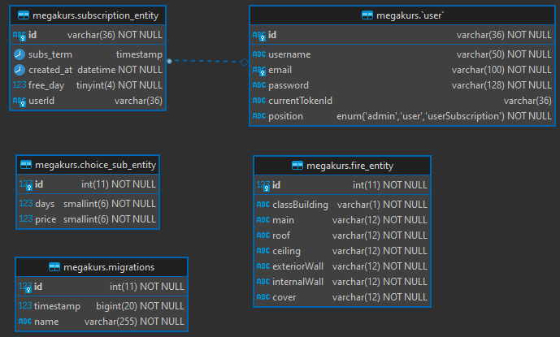

## Portal z narzędziami dla inżynierów budownictwa.
### Dla osób zalogowany i z możliwością wykupienia subskrypcji.

Projekt zawiera funkcjonalność polegającą na łączeniu się z backendem i pobiera podstawowe wartości potrzebne do obliczeń. Frontend dokonuje obliczeń. Dostęp do zawartości dla zalogowanych użytkowników.

__Technologie:__
- Express -> [link](https://expressjs.com/)
- NestJS -> [link](https://nestjs.com/)
- TypeORM -> [link](https://typeorm.io/)
- TypeScript -> [link](https://www.typescriptlang.org/)
- Passport JWT -> [link](http://www.passportjs.org/packages/passport-jwt/)
- bcryptjs -> [link](https://www.npmjs.com/package/bcryptjs)
- oraz sporo mniejszych paczek

__Funkcjonalności:__
- Rejestracja, logowanie i autentykacja użytkowników. Odbieranie od klienta danych lub ciastek. Sprawdzanie w bazie danych, czy użytkownik istnieje. Poprawna walidacja danych pochodzących od zewnętrznego klienta.
- Przesyłanie z bazy danych do klienta danych odnośnie np. subskrypcji — ilość dni i ceny.

__Dalszy rozwój:__
- Pełna implementacja modelu dojrzałości Richardsona na poziomie 2. Brakuje tylko zwrotów statusów. Serwis nie potrzebuje implementacji do poziomu 3 przy użyciu Hateoas.
- Tworzenie dodatkowych narzędzi dla projektantów.

W folderze ./db znajdują się komendy sql do tworzenia i wstawienia danych do tabel

#### Widok graficzny bazy danych:

Adres email: [Mateusz Mogielski](mailto:mogielski@protonmail.com).
